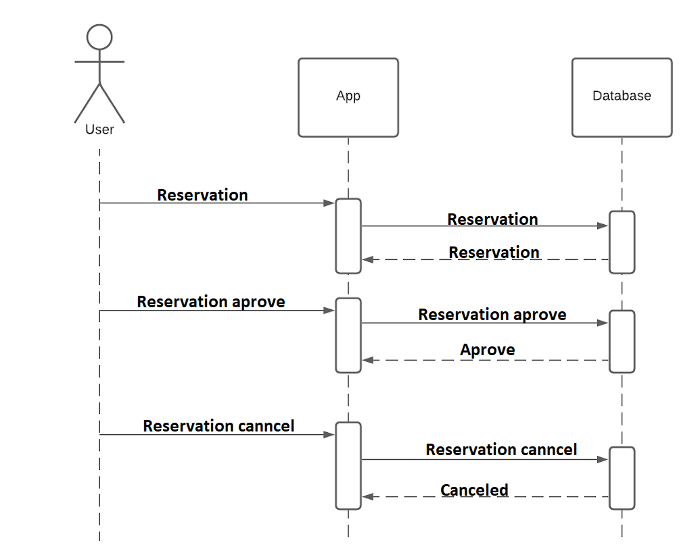
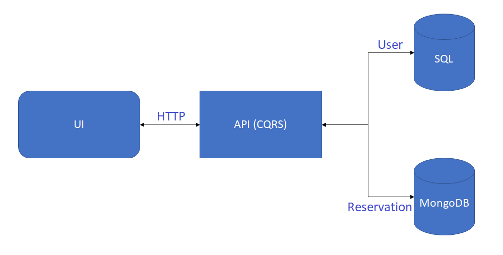
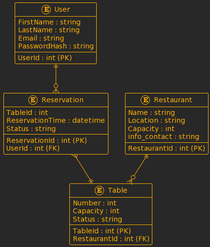

# **OakWood**

## **Table of Contents**

- [Team](#team)
- [Description](#project-description)
- [Architecture](#architecture)
- [Concurrency patterns usage](#concurrency-patterns-usage)
- [Analytics model](#Analytics-model)
  
- [Data model](#Data-model)
- [Resiliency model](#resiliency-model)
- [Deployment Model](#Deployment-Model)
- [Security model](#security-model)
- [Hosted Service](#hosted-service)
- [Monitoring & Alerting Model](#monitoring--alerting-model)

## **Team**

- Malets Bohdan
- Hnativ Dmytro 

## **Project Description**

### **Book a table**

This web application is for reserving tables in restaurants in advance and right before the trip.

### **Functional description**

The user can create an account and manage it. There will be the next pages for logged-in users: _My profile_ and _Reservations_ and the _Restaurants_ page :

- reserved
- restaurants
- profile

**Use cases**

| Use case                | Description                                                                                                                                                                                                                                                                                                |
| ----------------------- | ---------------------------------------------------------------------------------------------------------------------------------------------------------------------------------------------------------------------------------------------------------------------------------------------------------- |
| Sign up                 | Guest of web system can sign up by filling in next fields: <ul><li>Username</li><li>Email</li><li>Password</li></ul>                                                                                                                                                                                       |
| Log in                  | If the user has created an account he is able to log in to the system, by entering Email and Password that were filled in sign in the form before                                                                                                                                                          |
| Password recovery       | If a user forgot his password he can recover it by entering his email address. Then he will get a letter with the next instructions about password recovery                                                                                                                                                |
| Profile editing         | The user that is logged in the system can edit his personal information, such as Username, Email address and password                                                                                                                                                                                      |
| Table reservation       | The user is able to reserve a table using templates that are suggested by the web system. He needs to choose a table and based on his choice he will get a list of restaurans needed to be done                                                                                                            |
| Table reservation aprove| In the list of items that the user will get after choosing the needed table, he will need to set the date of the reservation, choose hours, book them and get aprove from restaurant                                                                                                            |  
| Table reservation canncel | When a user change his plan he can cancel reservation of his table in restaurants                

**Use case diagram**


<br/>
<br/>

**Guest sequence diagram**


<br/>
<br/>

**User sequence diagram**


<br/>
<br/>

## **Identity Management**

Identity Management in our restaurant reservation web application is a key aspect that ensures user security and personalization. Below is a description of the functionality and features associated with the identity management system:

Registration and Login:
The application allows users to create accounts by entering basic information (name, email, password). Upon registration, each user will be assigned a unique identifier. Password must be at least 8 characters long, including at least one uppercase and lowercase letter and one number. Email verification when registering with an email address that is already in use.

User profile:
After registration, users can add and modify information in their profile, such as contact information, food preferences, or other personalized information.

Password Recovery:
Enable users to recover forgotten passwords via email with a secure verification mechanism.

## **Functional requirements**

**Role: Client**
<br/>
Registration and Login:
- Ability to register a new account.
- Authorization by e-mail.

User profile:
- Changing and updating personal data in the profile.

Reservation of Tables:
- Choice of restaurant, date and time for booking.
- Selection of the number of guests.
- View the history of your reservations and their cancellations.
- Receipt of booking confirmation via e-mail.

**Role: Administrator**
<br/>
Management of Restaurants:
- Adding new restaurants and editing them.
- Indication of working hours, type of cuisine and other information.

Management of Reservations:
- View and manage all bookings.
- Confirmation or cancellation of reservations.

Statistics and Analytics:
- View statistics on the popularity of restaurants.
- Analysis of user reviews and ratings.

User Management System:
- Providing the ability to block or edit user accounts in cases of violations.


## **Architecture**

| Part of project | Description                                               | Technologies                  |
| --------------- | --------------------------------------------------------- | ----------------------------- |
| Back end        | API based on CQRS                                         | .NET 5, ASP.Net Core          |
| Fron end        | SPA                                                       | React, Type Script, AntDesign |
| DB              | SQL database for user management and NoSQL for user reservations | Azure SQL Database, MongoDB   |

<br/>

<br/>
<br/>


<br/>

## **Concurrency patterns usage**

Optimistic Concurrency Control:

**Database Schema:**
Include a version or timestamp field in the reservation table.

**Reservation Retrieval (Client Side):**
Fetch both the reservation details and the current version or timestamp value when displaying reservation information.

**User Edits (Client Side):**
When a user wants to modify a reservation, include the original version or timestamp value along with the updated reservation details.

**Server-Side Update:**
Compare the version or timestamp from the client with the one in the database.
If they match, proceed with the update; if not, handle the conflict by notifying the user.

**Conflict Resolution (Server Side and User Interface):**
Notify the user of a conflict and provide options to reload data, reapply changes, or merge changes with the updated reservation details.

**Client Notification:**
Use user-friendly messages and interface components to inform users of successful updates or conflicts.

**Concurrency Logging:**
Log concurrency conflicts and resolutions for auditing and analysis.

Pessimistic Concurrency Control:

**Database Schema:**
Include a lock_status field in the reservation table to indicate whether a reservation is currently locked by a user.

**Reservation Locking (Server Side):**
When a user starts editing a reservation, set the lock_status to "locked" in the database to prevent other users from editing the same reservation concurrently.
If the reservation is already locked, notify the user attempting to edit that the reservation is currently being edited by another user.

**Reservation Unlocking (Server Side):**
When the user finishes editing or cancels the reservation update, unlock the reservation by setting the lock_status to "unlocked."

**Timeouts and Release Mechanism:**
Implement a mechanism to release locks automatically after a certain period to handle cases where a user might close the browser or navigate away without explicitly unlocking.

**User Interface Feedback:**
Provide clear indications in the user interface when a reservation is locked by another user to avoid confusion.

Detecting Concurrency Conflicts:

**Database Schema:**
Ensure that each record in the relevant tables has a version or timestamp field.

**Reservation Retrieval (Client Side):**
When a user retrieves data for editing or viewing, fetch not only the reservation details but also the current value of the version or timestamp field.

**User Edits (Client Side):**
When the user makes changes to a reservation and submits them for an update, include the original version or timestamp value along with the updated reservation details.
**Server-Side Update:**
Upon receiving an update request, compare the version or timestamp from the client with the one in the database.
If they match, it means no other user has modified the record since the user loaded the data. Proceed with the update.
If there's a mismatch, handle the conflict by notifying the user.

**Conflict Handling (Server Side):**
Notify the user about the conflict and provide options for resolution.
Options may include reloading the data and reapplying their changes or merging their changes with the updated data.

**ER diagram:**

```sql
{
+----------------+       +-------------------+       +-------------------------+
|    User        |       |   Reservation    |       |      Restaurant         |
+----------------+       +-------------------+       +-------------------------+
| UserId (PK)    |1      *| ReservationId (PK)|       | RestaurantId (PK)      |
| FirstName      |-------<| UserId (FK)      |       | Name                    |
| LastName       |       | TableId (FK)     |       | Location                |
| Email          |       | ReservationTime  |       | Capacity                |
| PasswordHash   |       | Status           |       | ...                     |
| ...            |       +-------------------+       +-------------------------+
+----------------+                                   |         Table           |
                                                     +-------------------------+
                                                     | TableId (PK)            |
                                                     | RestaurantId (FK)      |
                                                     | Number                  |
                                                     | Capacity               |
                                                     | Status                  |
                                                     | ...                     |
                                                     +-------------------------+
}
```

## **Analytics model**


## **Data model**




**Entities description**
- User <=> Reservation: A user can have many reservations, but each reservation belongs to only one user. The relationship between a user and his reservations is determined by the UserId field in the Reservation table, which references the UserId in the User table.
- User <=> Table: The user can book tables. This happens through reservations, where the TableId field refers to the corresponding TableId in the Table table.
- Reservation <=> Table: Each reservation is associated with one specific table through the TableId field in the Reservation table, which points to the corresponding TableId in the Table table.
- Restaurant <=> Table: Each table is located in a certain restaurant through the RestaurantId field in the Table table, which refers to the corresponding RestaurantId in the Restaurant table.

**User**
- UserId – a person's ID (PK)
- FirstName – person's first name
- LastName – person's last name
- Email – person’s email
- PasswordHash – hash password

**Reservation**
- ReservationId – a reservation's ID (PK)
- UserId – a person's ID (FK)
- TableId – table's ID
- ReservationTime – reservation time
- Status – status of dish

**Restautant**
- RestaurantId – restaurant’s ID (PK)
- Name – restaurant’s name
- Location – restaurant’s address
- Capacity – restaurant’s capacity
- info_contact – restaurant’s contact information

**Table**
- TableId – a table’s ID (PK)
- RestaurantId – a reservation's ID (FK)
- Number – number of table
- Capacity – table capacity
- Status – table status

## **Data Retention Policy** <br/>
  This policy outlines how our table reservation service handles and retains user data. <br/>

**Types of Information Collected:** <br/>
- Information Provided by Users: To facilitate table reservations, users are required to provide personal details including their full name, email, and password during registration.
- Reservation Data: Information regarding the reservations made, including choice of restaurant, date, time, number of guests, and reservation status.
- Restaurant Information: Details about restaurants including name, location, contact information, capacity, working hours, and cuisine type.
  
**Utilization of Information:** <br/>
- Service Facilitation: The collected data is used to facilitate table reservations, manage user accounts, and provide personalized experiences.
- Improvement and Analytics: User data is anonymized and used for statistical analysis to enhance service quality, identify popular restaurants, and improve user experience.

**Information Sharing** <br/>
We maintain strict confidentiality standards and do not share user information with external parties. Restaurant details are made public for user reference but do not include specific user data.

**Data Retention Duration:** <br/>
- User profile information and reservation history are retained for the duration of the user's account existence.
- Reservation details are retained for statistical analysis and service improvement purposes.
- Restaurant information remains available for reference unless removed by the administrator.
**User Control:** <br/>
Users have complete control over their information. They can access, edit, update, or delete their profile and reservation history through their account settings.

**Administrator Rights:** <br/>
Administrators have the authority to manage restaurant information, view and manage all reservations, and handle user accounts. This includes confirmation, cancellation, and editing of reservations and the ability to block or modify user accounts in case of policy violations.

**Target Audience:** <br/>
Our services are intended for individuals above the age of 16 who can consent to personal data processing in their country. In some instances, parental or guardian consent might be required for minors.

## **Deployment Model**
```sql
{
+-----------------+        +-----------------+        +-----------------+
|   Клієнтська    |        |   Веб-сервер    |        |   Додаткові     |
|    сторона      |        |                 |        |    сервіси      |
|                 |        |                 |        |                 |
+------+----------+        +------+----------+        +-------+---------+
       |                         |                         |
       |                         | HTTP/HTTPS              |
       |                         |                         |
       |                         v                         v
       |                  +--------------+          +-----------------+
       |                  | Бізнес-логіка |          |    База даних   |
       |                  |   (API)      |          |                 |
       |                  +------+-------+          +-----------------+
       |                         |
       |                         | SQL/NoSQL
       |                         |
       |                         v
       |                  +--------------+
       |                  |   Система    |
       |                  |  бронювання |
       |                  +------+-------+
       |                         |
       |                         | CRUD Operations
       |                         |
       |                         v
       |                  +--------------+
       |                  |    Система   |
       |                  |  управління  |
       |                  |  рестораном |
       |                  +------+-------+
       |                         |
       |                         | RESTful API
       |                         |
       |                         v
       |                  +--------------+
       +----------------->|   Різні      |
                          |   сервіси   |
                          +--------------+
}
```

## **Resiliency Model**
**Component Interaction Diagram**
**Components of a Resiliency Model for Table Reservation System:**
1. Redundancy and Fault Tolerance:
- Data Redundancy: Implementing backup systems and databases to ensure data availability in case of failures.
- Load Balancing: Distributing incoming traffic across multiple servers to prevent overloads and ensure system stability.
2. Continuous Monitoring and Incident Response:
- Real-time Monitoring: Implementing monitoring tools to detect abnormalities, anomalies, or security threats in the system.
- Incident Response Plan: Developing and practicing a structured response plan to address potential system failures or security breaches promptly.
3. Data Backup and Recovery:
- Regular Backups: Creating and storing regular backups of critical data to minimize data loss in case of system failures.
- Disaster Recovery Plan: Establishing a comprehensive recovery plan to restore data and operations swiftly after a disaster.
4. Scalability and Elasticity:
- Auto-scaling: Utilizing cloud-based services or infrastructure that can automatically scale resources up or down based on demand.
- Flexible Architecture: Designing a system with a modular and flexible architecture that allows for easy adaptation to changing requirements.
5. Security Measures:
- Access Controls: Implementing robust authentication and authorization mechanisms to control access to sensitive data and system functionalities.
- Encryption: Ensuring that sensitive data is encrypted both in transit and at rest to prevent unauthorized access.
6. Testing and Simulation:
- Stress Testing: Conducting stress tests to evaluate system performance under extreme conditions or high loads.
- Simulated Failures: Simulating system failures to assess the readiness and effectiveness of recovery mechanisms.
7. Documentation and Training:
- Comprehensive Documentation: Maintaining clear documentation of system configurations, processes, and procedures for quick reference during incidents.
- Training Programs: Providing training to staff regarding system resilience strategies, incident response, and recovery procedures.
8. Collaboration and Communication:
- Cross-team Collaboration: Fostering collaboration between different teams involved in system maintenance, security, and recovery efforts.
- Communication Plans: Establishing communication channels and protocols to disseminate information effectively during incidents or crises.
9. Regulatory Compliance and Governance:
- Compliance Framework: Ensuring that the system adheres to relevant industry regulations and standards regarding data privacy and security.
- Regular Audits: Conducting regular audits to assess compliance and identify areas for improvement.
10. Adaptability and Innovation:
- Continuous Improvement: Encouraging a culture of continuous improvement and innovation to adapt to evolving threats and technologies.
- Feedback Loops: Establishing mechanisms to gather feedback from users and stakeholders for enhancing system resilience.
        
## **Resiliency Model (Rate)**
| No  | Effects                               | Portion Affected             | Detection        | Resolution                | Likelihood                         | Rate|
|---- |-------------------------------------- | ------------- |----------------- |-------------------------- | ---------------------------------- |---- |
|1	|No noticeable effect	|< 2%	|< 5 minutes	|5 min - 45 min	|< Once a year	|4|
|2	|Major impairment or data loss	|> 50%	|5 min - 15 min	|5 min - 45 min	> |Once a year	|96|
|3	|Major impairment or data loss	|> 50%	|5 min - 15 min	|5 min - 45 min	> |Once a year	|96|
|4	|No noticeable effect	|< 2%	|< 5 minutes	|< 5 minutes	|> Once a month	|4|
|5	|No noticeable effect	|< 2%	|< 5 minutes	|< 5 minutes	|> Once a month	|4|
|6	|Major impairment	|> 50%	|< 5 minutes |5 min - 45 min	|> Once a year	|96|
|7	|Major impairment	|> 50%	|< 5 minutes	|5 min - 45 min	|> Once a year	|96|
|8	|No noticeable effect	|< 2%	|< 5 minutes	|< 5 minutes	|> Once a year	|20|


## **Security Model**

**Main threats (Threats):**
1. Unauthorized access to users' personal data:
- Fraud: Using encryption to store passwords, regularly updating security systems, restricting access to personal data to only authorized users.
2. Attacks on authentication and user sessions:
- Mitigation: Use of two-factor authentication, protection against interception of session IDs, regular update of session tokens.
3. SQL injection and database attacks:
- Mitigation: Use of parameterized queries, validation and filtering of input data, use of signed queries to reduce the risk of vulnerability.
3. DDoS attacks (availability attacks):
- Mitigation: Using a CDN to protect against DDoS, setting up monitoring for timely response to attacks.
4. Data content threats (unauthorized data editing, for example):
- Mitigation: Use of version control systems, backup of data, restriction of access to data editing.
5. Social engineering (attacks on users):
- Migrating: Staff training on social engineering, use of multi-level identity verification methods.
6. Leakage of confidential information through unauthorized channels:
- Migrating: Encrypting confidential data at rest and in transit, restricting access to confidential data.
7. Vulnerabilities in software:
- Monitoring: Regular execution of software patches and updates, audit of software code vulnerabilities.
8. Insufficient API security:
- Mitigation: Using authentication and authorization for APIs, restricting access to API keys.
9. Insufficient audit security:
- Monitoring: Conducting regular security audits, identifying and fixing potential vulnerabilities.

**The minimum plan of measures (Mitigation Plan):**
1. Encryption of user data in the database and during transmission.
2. Use two-factor authentication for users and staff.
3. Conducting regular security audits to identify potential threats.
4. Protection against SQL injections through parameterized queries and data filtering.
5. Using monitoring to detect and respond to DDoS attacks.
6. Staff training on social engineering and data security.
7. Regular software updates and patches.
8. API access restrictions and authentication enforcement.
9. Regular backup and protection of confidential data.
10. Implementation of version control systems for data and restriction of editing access rights.

## **Authentication and Authorization**

**User Authentication:**
- Users must authenticate using secure methods, such as email and password. Implement strong password policies, including minimum length and complexity requirements. Consider multi-factor authentication for an added layer of security.


**Session Management:**
- Use secure session management techniques to prevent session hijacking. Implement session timeouts to automatically log out inactive users.


**Authorization:**
- Employ role-based access control (RBAC) to restrict access based on user roles (e.g., client, administrator). Ensure that users only have access to the functionalities and data relevant to their roles.

## **Data Security**

**Data Encryption:**
- Use HTTPS to encrypt data in transit between the client and the server. Employ encryption mechanisms (e.g., TLS) to secure communication channels.


**Password Storage:**
- Store passwords securely using strong, one-way encryption algorithms (e.g., bcrypt). Avoid storing plaintext passwords in the database.

**Data Integrity:**
- Implement data integrity checks to detect and prevent unauthorized modifications to data. Use hashing algorithms to verify data integrity.

## **Secure Development Practices**

**Code Review:**
- Conduct regular code reviews to identify and address security vulnerabilities. Follow secure coding practices and guidelines.

**Input Validation:**
- Validate and sanitize all user inputs to prevent common security issues such as SQL injection and cross-site scripting (XSS).


## **Security Libraries and Frameworks:**
- Utilize reputable security libraries and frameworks to handle authentication, authorization, and other security-related tasks.

## **Infrastructure Security**


**Server Security:**
- Regularly update and patch server software to address known vulnerabilities. Implement proper server hardening measures, including firewall configurations.


**Database Security:**
- Apply the principle of least privilege to database accounts. Regularly backup and encrypt sensitive data stored in the database.

## **Monitoring and Incident Response**
**Logging:**
- Implement comprehensive logging for user activities, authentication attempts, and system events. Regularly review and analyze logs to detect unusual activities.

**Incident Response Plan:**
- Develop an incident response plan outlining steps to take in case of a security incident. Conduct regular drills and updates to ensure the effectiveness of the plan.

## **Third-Party Integrations**


**Third-Party Security:**
- Evaluate and vet third-party services and integrations for security risks. Only use reputable and well-maintained third-party libraries and APIs.

## **User Education and Awareness**

**User Training:**
- Educate users about security best practices, such as choosing strong passwords and recognizing phishing attempts. Provide clear guidelines on how to report security concerns or incidents.

**Privacy Policies:**
- Clearly communicate privacy policies to users, detailing how their data will be used, stored, and protected.

## **Compliance**

Regulatory Compliance:
- Ensure compliance with relevant data protection regulations and standards. Regularly review and update security practices to align with changing compliance requirements.

## **Monitoring & Alerting Model**


Local application insights
