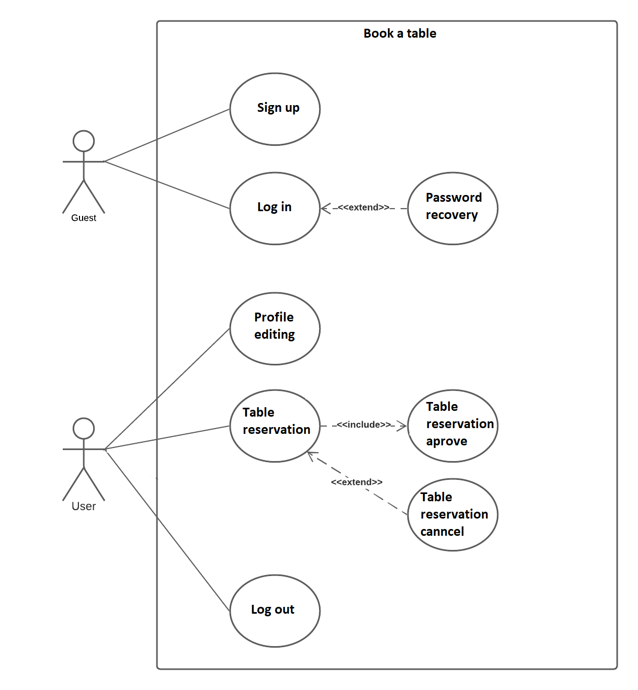

# **OakWood**

## **Table of Contents**

- [Team](#team)
- [Description](#project-description)
- [Architecture](#architecture)
- [Concurrency patterns usage](#monitoring)
- [Storage](#storage)
- [Resiliency model](#resiliency-model)
- [Security model](#security-model)
- [Hosted Service](#hosted-service)
- [Telemetry](#telemetry)
- [Monitoring](#monitoring)

## **Team**

- Malets Bohdan
- Hnativ Dmytro 

## **Project Description**

### **Book a table**

This web application is for reserving tables in restaurants in advance and right before the trip.

### **Functional description**

The user can create an account and manage it. There will be the next pages for logged-in users: _My profile_ and _Reservations_ and the _Restaurants_ page :

- reserved
- restaurants
- profile

**Use cases**

| Use case                | Description                                                                                                                                                                                                                                                                                                |
| ----------------------- | ---------------------------------------------------------------------------------------------------------------------------------------------------------------------------------------------------------------------------------------------------------------------------------------------------------- |
| Sign up                 | Guest of web system can sign up by filling in next fields: <ul><li>Username</li><li>Email</li><li>Password</li></ul>                                                                                                                                                                                       |
| Log in                  | If the user has created an account he is able to log in to the system, by entering Email and Password that were filled in sign in the form before                                                                                                                                                          |
| Password recovery       | If a user forgot his password he can recover it by entering his email address. Then he will get a letter with the next instructions about password recovery                                                                                                                                                |
| Profile editing         | The user that is logged in the system can edit his personal information, such as Username, Email address and password                                                                                                                                                                                      |
| Table reservation       | The user is able to reserve a table using templates that are suggested by the web system. He needs to choose a table and based on his choice he will get a list of restaurans needed to be done                                                                                                            |
| Table reservation aprove| In the list of items that the user will get after choosing the needed table, he will need to set the date of the reservation, choose hours, book them and get aprove from restaurant                                                                                                            |  
| Table reservation canncel | When a user change his plan he can cancel reservation of his table in restaurants                

**Use case diagram**

 
 

**Guest sequence diagram**

 
 

**User sequence diagram**

 
 

## **Identity Management**

Identity Management in our restaurant reservation web application is a key aspect that ensures user security and personalization. Below is a description of the functionality and features associated with the identity management system:

Registration and Login:
The application allows users to create accounts by entering basic information (name, email, password). Upon registration, each user will be assigned a unique identifier. Password must be at least 8 characters long, including at least one uppercase and lowercase letter and one number. Email verification when registering with an email address that is already in use.

User profile:
After registration, users can add and modify information in their profile, such as contact information, food preferences, or other personalized information.

Password Recovery:
Enable users to recover forgotten passwords via email with a secure verification mechanism.

## **Architecture**

| Part of project | Description                                               | Technologies                  |
| --------------- | --------------------------------------------------------- | ----------------------------- |
| Back end        | API based on CQRS                                         | .NET 5, ASP.Net Core          |
| Fron end        | SPA                                                       | React, Type Script, AntDesign |
| DB              | SQL database for user management and NoSQL for user reservations | Azure SQL Database, MongoDB   |

 

 
 

**ER diagram**

 
 

## **Concurrency patterns usage**

## **Telemetry**

## **Storage**

## **Resiliency Model**

## **Security Model**

## **Hosted Service**

## **Telemetry**

Local application insights

## **Monitoring**
